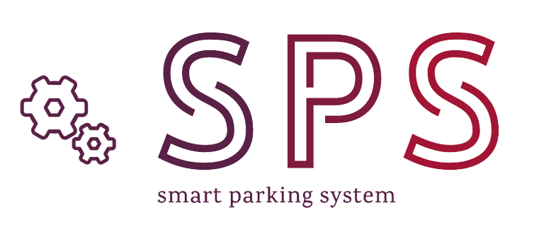

<h1 align="center">Smart Parking System</h1>
<p align="center">Project iot yang dikembangkan oleh <a href="https://github.com/zuramai/mazer"> Aldi</a></p>
<p align="center">

[](#contributors-)




## Installation
clone the project
```bash
git clone https://github.com/renaldi-oss/sps-react.git  
```
```bash
npm install 
```
```bash
npm run start
```

## Documentation
on the way

## Demo
Open the [demo page](https://sps-iot.vercel.app/)

## Contributing
Currently, not accepting any pull request. But, you can fork this project.

## License
free to use and open for everyone

## About the Author
Snart Parking System is created by <a href="https://www.linkedin.com/in/reynaldi-fakhri-pratama-264575208/">Aldi</a>. 